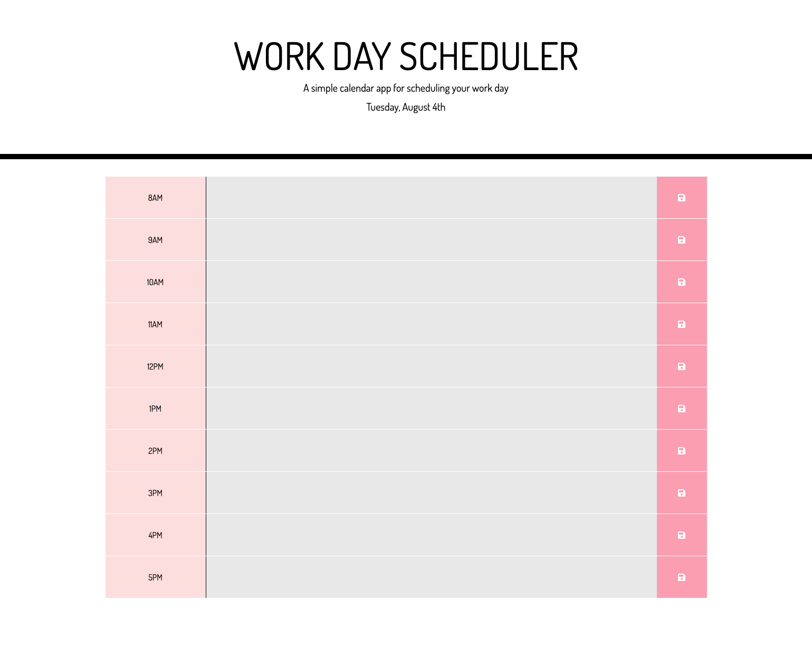

# Day Planner
This application is a simple calander that allows the user to save events for each hour of the day. This run's in the browser and feature's dynamically updated HTML and CSS powered by jQuery. In addition the app display's standard business hours (8AM to 5PM) along the left hand side of each input row. Depending on the time of day, the schedule input feilds update their color indicating to the user wether items are in the past, present or future.

## Link
Please visit [My Day Planner](https://juhee-k.github.io/day-planner/) site!

## Screenshots

## Built with
- [jQuery](https://api.jquery.com/)
- [HTML](https://developer.mozilla.org/en-US/docs/Web/HTML)
- [CSS](https://developer.mozilla.org/en-US/docs/Web/CSS)
- [Bootstrap](https://getbootstrap.com/)
- [Google Fonts](https://fonts.google.com/)
